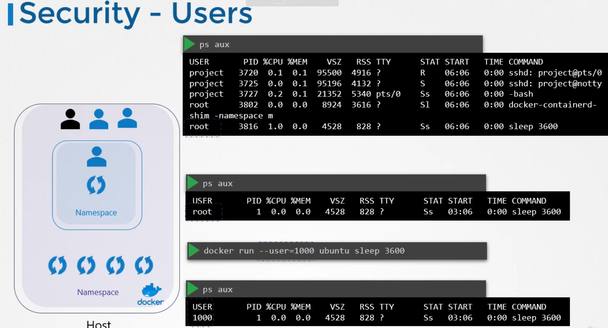
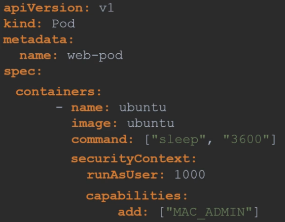

## Docker security
### Security
THe host has a number of processes within. Unlike VMs, containers are not completely isolated from their host (share the same kernel)\
Containers are isolated using Namespaces in Linux.\
So when you list the processes from within the DOcker container, you can see the sleep process witha a process ID (PID) of 1.

The root user has the unlimited capabilities to do almost anything `/usr/include/linux/capability.h`
To override the rule and provide additional privileges, use `--cap-add`, or remove `--cap-drop`, all enable all with the `--privileged` flag
```
docker run --user=1001 ubuntu sleep 3000
docker run --cap-add MAC_ADMIN ubuntu
docker run --cap-drop MAC_ADMIN ubuntu
docker run --privileged ubuntu
```

These can be configured in K8s as well, because containers are encapsulated in pods, so can config the security settings\
at a **container level** or at a **pod level**.\
If config at **pod level**, setting will be carried over to all containers within the pod.\
if config at **container level**, setting on the container will override the settings on the pod

