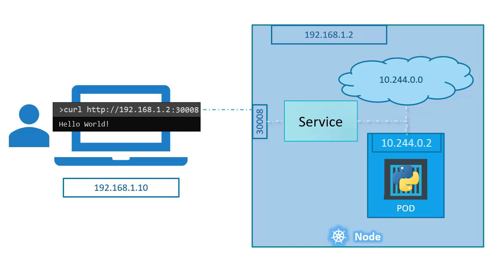
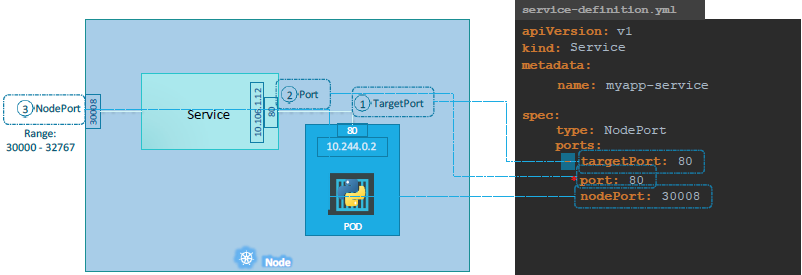
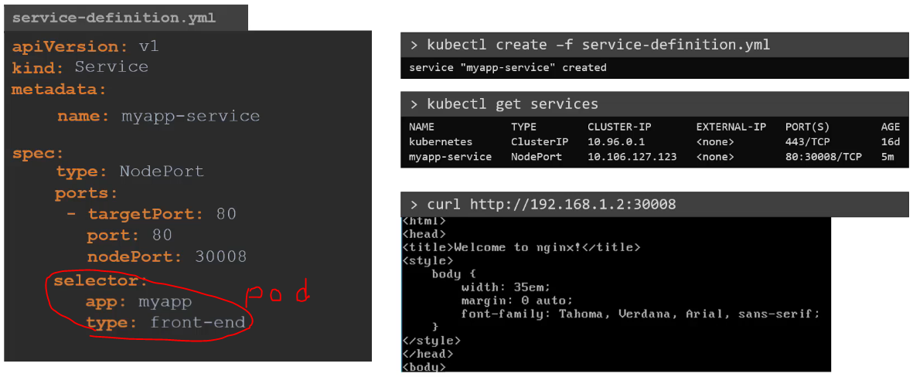
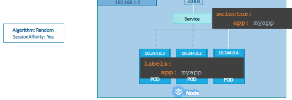
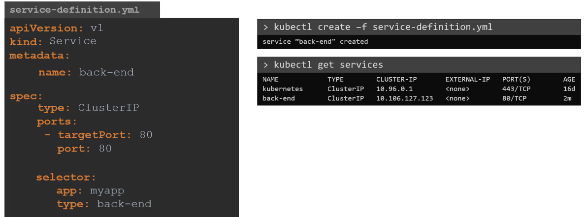

**Service:** 

Just like replica set / deployment. One use case is to listen to a port on the Node and forward requests on that port to a port on the POD running the web application

* **Service types:**

  * **NodePort**: service mapped to a certain pod

    * 

    * `port` is the only mandatory field. If `targetPort` not specified, same as `port`. If `nodePort` not specified, a free between 30000-32767 will be allocated.

    * 

    * 

    * Sum up: in ANY case weather it be a *single pod* in a *single node*, *multiple pods* on a *single node*, *multiple pods* on *multiple nodes*, the service is created **exactly the same** without you having to do any additional steps during the service creation.

  * **ClusterIP**

    * 

  * **LoadBalancer**

* **Endpoints:**

  * the service identifies all the posd with the same label and direct traffic to those pods. If additional pods created by accident with the same label, running `kubectl describe service service` will show all the endpoints.
